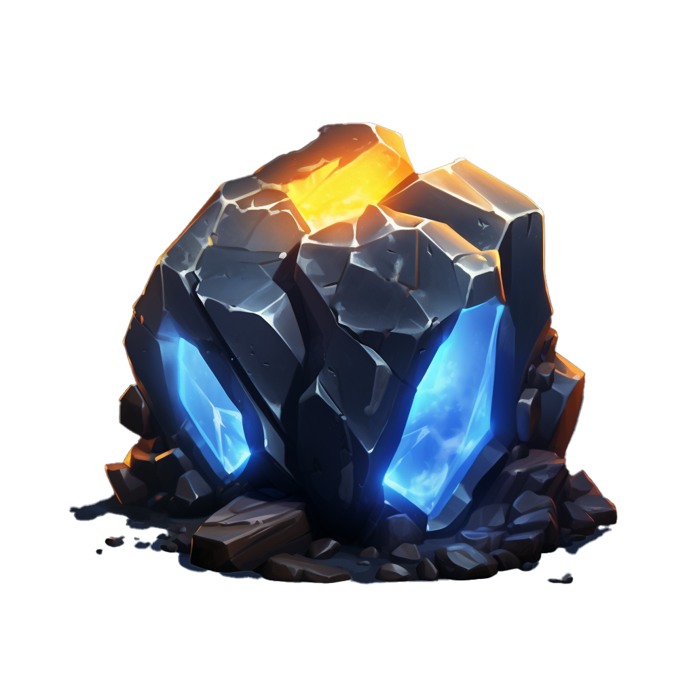

<a name="readme-top"></a>

[![Contributors][contributors-shield]][contributors-url]
[![Forks][forks-shield]][forks-url]
[![Stargazers][stars-shield]][stars-url]
[![Issues][issues-shield]][issues-url]
[![MIT License][license-shield]][license-url]
[![LinkedIn][linkedin-shield]][linkedin-url]
[![X][x-shield]][x-url]


<!-- PROJECT HEADER -->
<br />
<div align="center">
  <a href="https://github.com/seanmishra/project-etherite">
    
  </a>

<h3 align="center">Project Etherite</h3>

  <p align="center">
    An awesome template to bootstrap your Node.js & MongoDB based RESTful web service project!
    <br />
    <a href="#getting-started"><strong>Get Started »</strong></a>
    <br />
    <br />
    <a href="https://github.com/seanmishra/project-etherite/issues">Report Bug</a>
    ·
    <a href="https://github.com/seanmishra/project-etherite/issues">Request Feature</a>
  </p>
</div>


<!-- TABLE OF CONTENTS -->
<details>
  <summary>Table of Contents</summary>
  <ol>
    <li>
      <a href="#about-the-project">About The Project</a>
      <ul>
        <li><a href="#built-with">Built With</a></li>
      </ul>
    </li>
    <li>
      <a href="#getting-started">Getting Started</a>
      <ul>
        <li><a href="#prerequisites">Prerequisites</a></li>
        <li><a href="#installation">Installation</a></li>
      </ul>
    </li>
    <li><a href="#usage">Usage</a></li>
    <li><a href="#roadmap">Roadmap</a></li>
    <li><a href="#contributing">Contributing</a></li>
    <li><a href="#license">License</a></li>
    <li><a href="#contact">Contact</a></li>
    <li><a href="#acknowledgments">Acknowledgments</a></li>
  </ol>
</details>


<!-- ABOUT THE PROJECT -->
## About The Project

There are many great Node.js & MongoDB based RESTful web service templates available on GitHub, however, I didn't find one that really suit my needs so I created this one. I wanted to create a template that was easy to bootstrap with, had a base set of necessary features, and was easy to customize. This is the template that I use to bootstrap my microservices and [Jamstack][Jamstack-url] backend projects.

It is a simple, yet powerful, RESTful web service template that provides a solid foundation for building Node.js & MongoDB based web services. It also has OAuth 2.0 support built-in which can be optionally enabled for quick user authentication and endpoint scope validation using the provided middlewares.

It is very easy to get started with this template. Just create your own project repository from this template and follow the instructions below to set a few environment variables. That's it! You will be ready to start building your own web service in no time.

<p align="right">(<a href="#readme-top">back to top</a>)</p>


### Built With

- [![Node.js][Node.js]][Node-url]
- [![Express.js][Express.js]][Express-url]
- [![MongoDB][MongoDB]][MongoDB-url]
- [![Dotenv][Dotenv]][Dotenv-url]

<p align="right">(<a href="#readme-top">back to top</a>)</p>


<!-- GETTING STARTED -->
## Getting Started

To get a local copy up and running follow these simple example steps.

### Prerequisites

<!-- This is an example of how to list things you need to use the software and how to install them.
* npm
  ```sh
  npm install npm@latest -g
  ``` -->

### Installation

<!-- 1. Get a free API Key at [https://example.com](https://example.com)
2. Clone the repo
   ```sh
   git clone https://github.com/seanmishra/project-etherite.git
   ```
3. Install NPM packages
   ```sh
   npm install
   ```
4. Enter your API in `config.js`
   ```js
   const API_KEY = 'ENTER YOUR API';
   ``` -->

<p align="right">(<a href="#readme-top">back to top</a>)</p>


<!-- USAGE EXAMPLES -->
## Usage

<!-- Use this space to show useful examples of how a project can be used. Additional screenshots, code examples and demos work well in this space. You may also link to more resources.

_For more examples, please refer to the [Documentation](https://example.com)_ -->

<p align="right">(<a href="#readme-top">back to top</a>)</p>


<!-- ROADMAP -->
## Roadmap

- [x] Add OAuth 2.0 support
- [x] Add user authentication and endpoint scope validation middlewares
- [x] Add environment variable support
- [ ] Add Docker support
- [ ] Add Kubernetes support
- [ ] Add tests and CI/CD support


See the [open issues](https://github.com/seanmishra/project-etherite/issues) for a full list of proposed features (and known issues).

<p align="right">(<a href="#readme-top">back to top</a>)</p>


<!-- CONTRIBUTING -->
## Contributing

Contributions are what make the open source community such an amazing place to learn, inspire, and create. Any contributions you make are **greatly appreciated**.

If you have a suggestion that would make this better, please fork the repo and create a pull request. You can also simply open an issue with the tag "enhancement".
Don't forget to give the project a star! Thanks again!

1. Fork the Project
2. Create your Feature Branch (`git checkout -b feature/AmazingFeature`)
3. Commit your Changes (`git commit -m 'Add some AmazingFeature'`)
4. Push to the Branch (`git push origin feature/AmazingFeature`)
5. Open a Pull Request

<p align="right">(<a href="#readme-top">back to top</a>)</p>


<!-- LICENSE -->
## License

Distributed under the MIT License. See `LICENSE.md` for more information.

<p align="right">(<a href="#readme-top">back to top</a>)</p>


<!-- CONTACT -->
## Contact

Sean Mishra - [seanmishra.com](https://seanmishra.com)

Project Link: [https://github.com/seanmishra/project-etherite](https://github.com/seanmishra/project-etherite)

<p align="right">(<a href="#readme-top">back to top</a>)</p>


<!-- ACKNOWLEDGMENTS -->
## Acknowledgments

- [Img Shields](https://shields.io)
- [Choose an Open Source License](https://choosealicense.com)
- [GitHub Pages](https://pages.github.com)
- [Font Awesome](https://fontawesome.com)


<p align="right">(<a href="#readme-top">back to top</a>)</p>


<!-- MARKDOWN LINKS & IMAGES -->
<!-- https://www.markdownguide.org/basic-syntax/#reference-style-links -->
[contributors-shield]: https://img.shields.io/github/contributors/seanmishra/project-etherite.svg?style=for-the-badge
[contributors-url]: https://github.com/seanmishra/project-etherite/graphs/contributors
[forks-shield]: https://img.shields.io/github/forks/seanmishra/project-etherite.svg?style=for-the-badge
[forks-url]: https://github.com/seanmishra/project-etherite/network/members
[stars-shield]: https://img.shields.io/github/stars/seanmishra/project-etherite.svg?style=for-the-badge
[stars-url]: https://github.com/seanmishra/project-etherite/stargazers
[issues-shield]: https://img.shields.io/github/issues/seanmishra/project-etherite.svg?style=for-the-badge
[issues-url]: https://github.com/seanmishra/project-etherite/issues
[license-shield]: https://img.shields.io/github/license/seanmishra/project-etherite.svg?style=for-the-badge
[license-url]: https://github.com/seanmishra/project-etherite/blob/master/LICENSE.md
[linkedin-shield]: https://img.shields.io/badge/-seanmishra-black.svg?style=for-the-badge&logo=linkedin&color=555
[linkedin-url]: https://linkedin.com/in/seanmishra
[x-shield]: https://img.shields.io/badge/-seansapiens-black.svg?style=for-the-badge&logo=x&color=555
[x-url]: https://x.com/seansapiens
[Jamstack-url]: https://jamstack.org/
[Node.js]: https://img.shields.io/badge/Node.js-43853D?style=for-the-badge&logo=nodedotjs&logoColor=white
[Node-url]: https://nodejs.org/
[Express.js]: https://img.shields.io/badge/Express.js-white?style=for-the-badge&logo=express&logoColor=black
[Express-url]: https://expressjs.com/
[MongoDB]: https://img.shields.io/badge/MongoDB-4EA94B?style=for-the-badge&logo=mongodb&logoColor=white
[MongoDB-url]: https://www.mongodb.com/
[Dotenv]: https://img.shields.io/badge/Dotenv-gold?style=for-the-badge&logo=dotenv&logoColor=black
[Dotenv-url]: https://www.npmjs.com/package/dotenv
